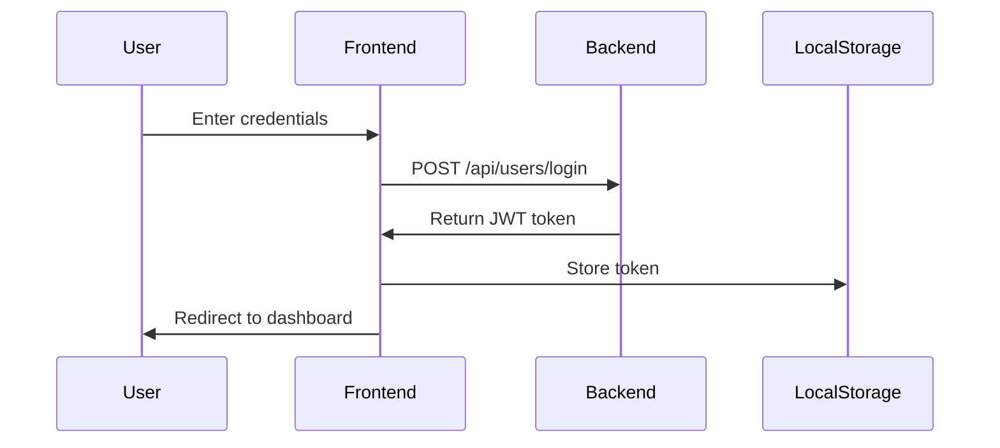

# Hostel Complaint Portal - Frontend Documentation

## 📋 Table of Contents
- [Introduction](#introduction)
- [Getting Started](#getting-started)
- [Project Structure](#project-structure)
- [Features](#features)
- [Technical Architecture](#technical-architecture)
- [Authentication](#authentication)
- [Components](#components)
- [API Integration](#api-integration)
- [State Management](#state-management)
- [Routing](#routing)
- [Step-by-Step Guides](#step-by-step-guides)
- [Troubleshooting](#troubleshooting)
- [Learning Resources](#learning-resources)

## 🌟 Introduction
The Hostel Complaint Portal is a web application designed to streamline the process of lodging and managing hostel-related complaints. This documentation focuses on the frontend of the application, built with Next.js, React, and TypeScript.

### Purpose
- Allow students to submit complaints about hostel facilities
- Enable administrators to track and manage complaints
- Provide a user-friendly interface for both students and administrators

## 🚀 Getting Started

### Prerequisites
- Node.js (v14.x or later)
- npm or yarn package manager
- Backend API running (refer to backend documentation)

### Installation
1. Clone the repository:
   ```
   git clone https://github.com/yourusername/hostel-complaint-portal.git
   cd hostel-complaint-portal/frontend
   ```

2. Install dependencies:
   ```
   npm install
   ```

3. Create a `.env.local` file in the root directory:
   ```
   NEXT_PUBLIC_API_URL=http://localhost:8000/api
   ```

4. Start the development server:
   ```
   npm run dev
   ```

5. Open your browser and navigate to `http://localhost:3000`

## 📁 Project Structure
```
frontend/
├── src/                    # Source files
│   ├── app/                # Next.js app router pages
│   │   ├── login/          # Login/register page
│   │   ├── dashboard/      # Dashboard page
│   │   └── page.tsx        # Home page
│   ├── components/         # Reusable React components
│   ├── services/           # API and utility services
│   │   └── api.ts          # API service functions
│   └── styles/             # CSS and styling files
├── public/                 # Static files
└── package.json            # Project dependencies
```

## ✨ Features

### User Authentication
- User registration with role selection
- Secure login with JWT authentication
- Protected routes based on user role

### Student Features
- Dashboard showing personal complaint history
- Form to submit new complaints
- Ability to track complaint status

### Administrator Features
- Dashboard showing all complaints
- Ability to update complaint status
- Filter and sort complaint records

## 🏗️ Technical Architecture

### Technology Stack
- **Framework**: Next.js 13+ with App Router
- **UI Library**: React 18+
- **Language**: TypeScript
- **Styling**: Tailwind CSS
- **HTTP Client**: Native fetch API
- **Authentication**: JWT-based auth

### Application Flow
1. User authentication (login/register)
2. Dashboard loads based on user role
3. API calls to fetch and display data
4. User interactions trigger state updates and API calls
5. Responses update UI accordingly

## 🔒 Authentication

### Authentication Flow


### Code Implementation
```typescript
// Login function in services/api.ts
export async function login(email: string, password: string) {
  const response = await fetch(`${API_URL}/users/login`, {
    method: "POST",
    headers: {
      "Content-Type": "application/json",
    },
    body: JSON.stringify({ email, password }),
  });

  if (!response.ok) {
    const error = await response.json();
    throw new Error(error.detail || "Login failed");
  }

  return response.json(); // Returns { access_token, token_type, role }
}
```

### Token Storage
We store the authentication token in localStorage:
```typescript
localStorage.setItem("token", data.access_token);
localStorage.setItem("userRole", data.role);
```

### Protected Routes
We implement protection using React hooks:
```typescript
function useAuthProtection() {
  const router = useRouter();

  useEffect(() => {
    const token = localStorage.getItem("token");
    if (!token) {
      router.push("/login");
    }
  }, [router]);
}
```

## 🧩 Components

### Key Components

#### AuthPage (Login/Register)
- **Purpose**: Handles user authentication
- **Features**:
  - Login form
  - Registration form
  - Form toggling
  - Input validation
  - Error handling

#### Dashboard
- **Purpose**: Main interface after login
- **Features**:
  - Complaint listing
  - Complaint submission form
  - Status badges
  - Role-based views

#### ComplaintForm
- **Purpose**: Submit new complaints
- **Features**:
  - Form fields for complaint details
  - Category selection
  - Form validation
  - Submission handling

## 🌐 API Integration

### API Service
We use a centralized API service in `services/api.ts` for all backend communication:

```typescript
const API_URL = "http://localhost:8000/api";

export async function getComplaints(token: string) {
  const response = await fetch(`${API_URL}/complaints`, {
    headers: {
      Authorization: `Bearer ${token}`,
    },
  });

  if (!response.ok) {
    throw new Error("Failed to get complaints");
  }

  return response.json();
}
```

### Available API Functions
- `login(email, password)`: Authenticate user
- `register(userData)`: Register new user
- `getProfile(token)`: Get current user profile
- `getComplaints(token)`: Get complaints based on user role
- `submitComplaint(token, complaintData)`: Submit new complaint
- `updateComplaintStatus(token, complaintId, status)`: Update complaint status

## 📊 State Management

This project uses React's built-in state management with hooks:

### Component State
```typescript
// Example from Dashboard component
const [complaints, setComplaints] = useState<Complaint[]>([]);
const [user, setUser] = useState<User | null>(null);
const [loading, setLoading] = useState(true);
const [error, setError] = useState("");
```

### Form State
```typescript
// Example from complaint form
const [newComplaint, setNewComplaint] = useState({
  category: "",
  title: "",
  description: "",
});

const handleChange = (e) => {
  setNewComplaint({...newComplaint, [e.target.name]: e.target.value});
};
```

### Authentication State
Authentication state is managed via localStorage to persist across sessions.

## 🧭 Routing

We use Next.js App Router for navigation:

### Page Structure
- `/`: Home page (redirects to login or dashboard)
- `/login`: Authentication page
- `/dashboard`: Main application interface

### Navigation
```typescript
import { useRouter } from 'next/navigation';

// Example navigation
const router = useRouter();
router.push('/dashboard');
```

## 📝 Step-by-Step Guides

### Adding a New Page
1. Create a new directory in `src/app/` (e.g., `profile`)
2. Create a `page.tsx` file inside the directory
3. Implement the page component:
   ```typescript
   "use client";
   
   import { useEffect, useState } from "react";
   
   export default function ProfilePage() {
     const [profile, setProfile] = useState(null);
     
     // Fetch profile data...
     
     return (
       <div>
         <h1>User Profile</h1>
         {/* Profile content */}
       </div>
     );
   }
   ```

### Creating a New Component
1. Create a new file in `src/components/` directory
2. Implement the component:
   ```typescript
   import { useState } from "react";
   
   interface ButtonProps {
     text: string;
     onClick: () => void;
   }
   
   export function CustomButton({ text, onClick }: ButtonProps) {
     return (
       <button 
         onClick={onClick}
         className="bg-blue-600 text-white py-2 px-4 rounded-md hover:bg-blue-700"
       >
         {text}
       </button>
     );
   }
   ```
3. Import and use in your pages

### Adding a New API Endpoint
1. Open `services/api.ts`
2. Add a new function:
   ```typescript
   export async function updateUserProfile(token: string, profileData: any) {
     const response = await fetch(`${API_URL}/users/profile`, {
       method: "PUT",
       headers: {
         "Content-Type": "application/json",
         Authorization: `Bearer ${token}`,
       },
       body: JSON.stringify(profileData),
     });
   
     if (!response.ok) {
       const error = await response.json();
       throw new Error(error.detail || "Failed to update profile");
     }
   
     return response.json();
   }
   ```

## ❗ Troubleshooting

### Common Issues

#### "Failed to fetch" Errors
- **Cause**: Backend server not running or network issues
- **Solution**: 
  - Ensure backend is running on the expected URL
  - Check for CORS issues in backend configuration
  - Verify network connectivity

#### Authentication Issues
- **Cause**: Token expired or invalid
- **Solution**:
  - Check token format
  - Implement token refresh mechanism
  - Clear localStorage and re-login

#### White Text on White Background
- **Cause**: Missing text color classes in form inputs
- **Solution**: Add `text-gray-900` class to all form inputs

#### Data Not Displaying
- **Cause**: Failed API requests or data parsing issues
- **Solution**:
  - Check browser console for errors
  - Verify API endpoint responses
  - Add better error handling

## 📚 Learning Resources

### React and Next.js
- [React Documentation](https://react.dev/)
- [Next.js Documentation](https://nextjs.org/docs)
- [TypeScript Handbook](https://www.typescriptlang.org/docs/)

### CSS and Styling
- [Tailwind CSS Documentation](https://tailwindcss.com/docs)

### JavaScript/TypeScript
- [MDN JavaScript Guide](https://developer.mozilla.org/en-US/docs/Web/JavaScript/Guide)
- [TypeScript Deep Dive](https://basarat.gitbook.io/typescript/)